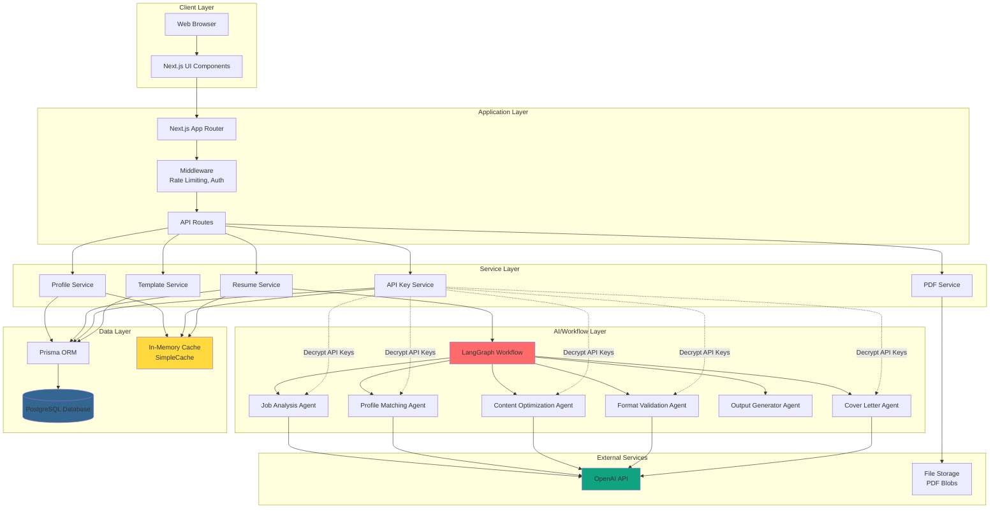
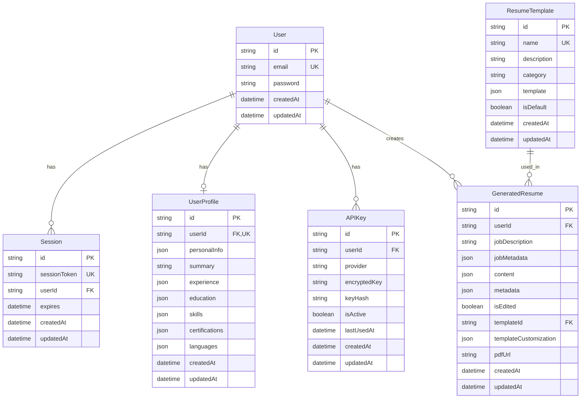
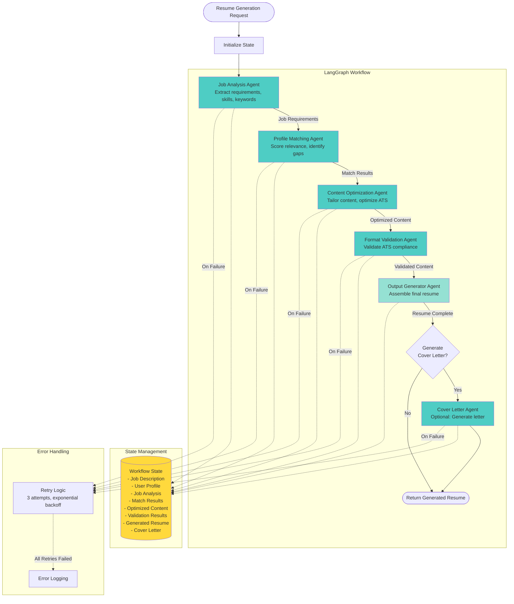
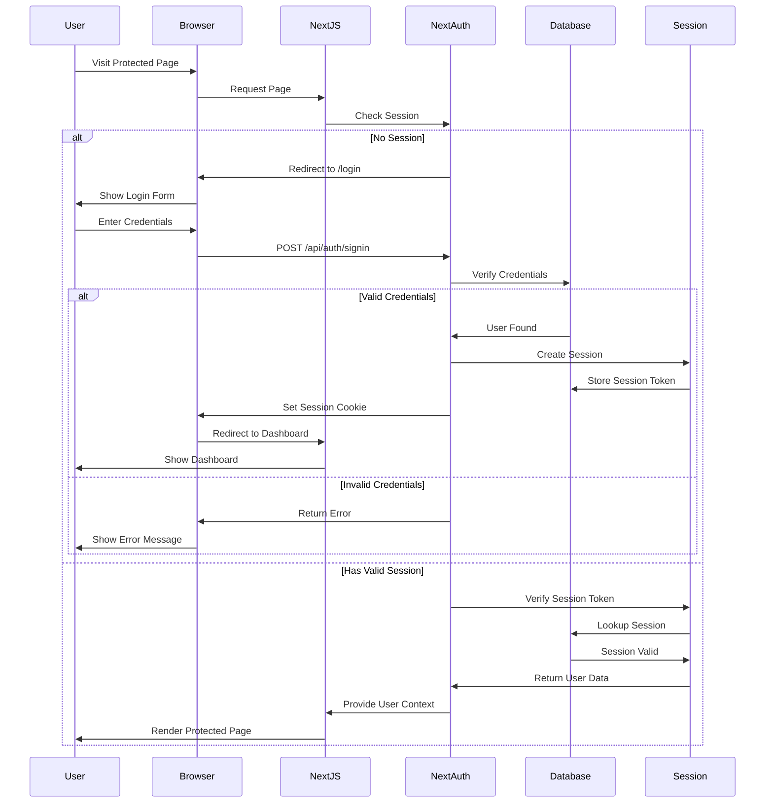
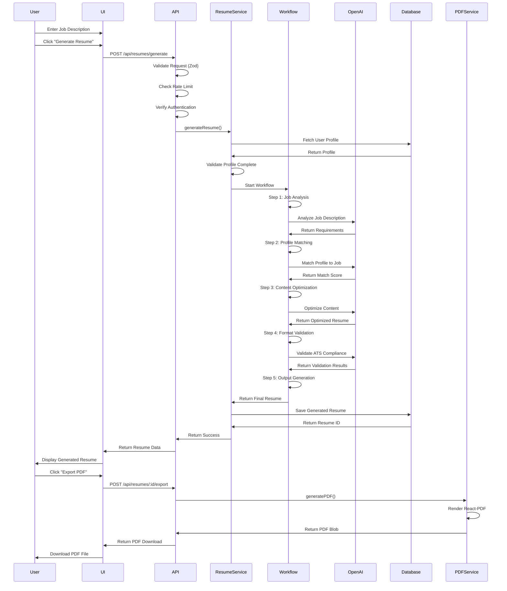
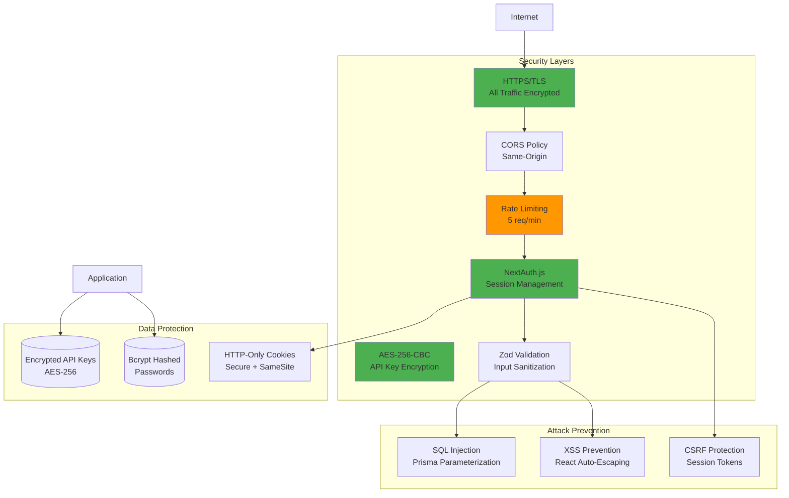
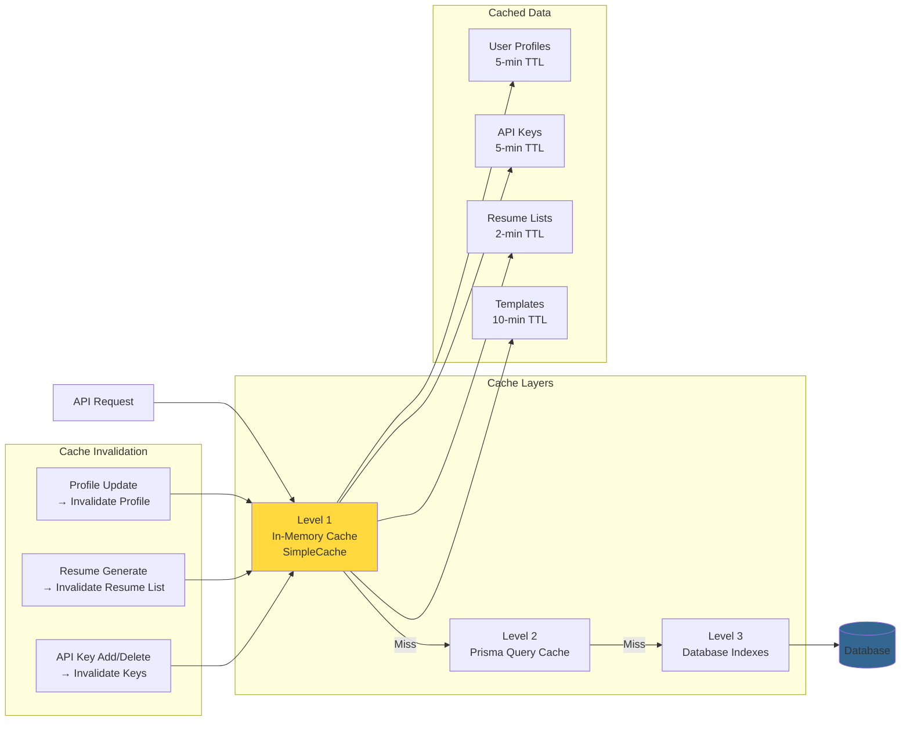

# Architecture Documentation

This document provides comprehensive architectural diagrams for the AI Resume Optimizer Platform, covering system architecture, database schema, AI workflow, and component relationships.

---

## Table of Contents

1. [System Architecture Overview](#system-architecture-overview)
2. [Database Schema](#database-schema)
3. [AI Workflow Architecture](#ai-workflow-architecture)
4. [Component Architecture](#component-architecture)
5. [API Routes Structure](#api-routes-structure)
6. [Authentication Flow](#authentication-flow)
7. [Resume Generation Flow](#resume-generation-flow)
8. [Deployment Architecture](#deployment-architecture)

---

## System Architecture Overview



---

## Database Schema



**Key Relationships:**
- **User → UserProfile**: One-to-One (optional profile)
- **User → APIKey**: One-to-Many (multiple providers)
- **User → GeneratedResume**: One-to-Many (resume history)
- **User → Session**: One-to-Many (multiple active sessions)
- **ResumeTemplate → GeneratedResume**: One-to-Many (template usage)

**Indexes:**
- `User.email` - Unique index for authentication
- `Session.sessionToken` - Unique index for session lookup
- `UserProfile.userId` - Unique index for profile lookup
- `APIKey.userId` - Index for user's keys lookup
- `APIKey.provider` - Composite index with userId for provider-specific queries
- `GeneratedResume.userId` - Index for user's resume history
- `GeneratedResume.createdAt` - Index for date-based queries

---

## AI Workflow Architecture



**Workflow Characteristics:**
- **Sequential Processing**: Each agent builds on previous results
- **State Persistence**: All intermediate results stored in workflow state
- **Error Recovery**: Automatic retry with exponential backoff (1s, 2s, 4s)
- **Conditional Branching**: Cover letter generation is optional
- **Token Tracking**: Each agent tracks OpenAI API token usage
- **Checkpointing**: State can be saved/restored (MemorySaver)

---

## Component Architecture

```mermaid
graph TB
    subgraph "Pages"
        HomePage[Home Page<br/>/]
        LoginPage[Login Page<br/>/login]
        RegisterPage[Register Page<br/>/register]
        DashboardPage[Dashboard<br/>/dashboard]
        ProfilePage[Profile Page<br/>/profile]
        GeneratePage[Generate Page<br/>/generate]
        ResumesPage[Resumes List<br/>/resumes]
        ResumeDetailPage[Resume Detail<br/>/resumes/[id]]
        SettingsPage[Settings<br/>/settings]
        TemplatesPage[Templates<br/>/templates]
        CoverLetterPage[Cover Letter<br/>/cover-letter]
    end

    subgraph "Profile Components"
        PersonalInfoForm[Personal Info Form]
        ExperienceForm[Experience Form]
        EducationForm[Education Form]
        SkillsForm[Skills Form]
        CertificationsForm[Certifications Form]
        LanguagesForm[Languages Form]
    end

    subgraph "Resume Components"
        ResumePreview[Resume Preview]
        ResumeEditor[Resume Editor]
        SectionOrderEditor[Section Order Editor]
    end

    subgraph "Template Components"
        TemplateGallery[Template Gallery]
        TemplateCard[Template Card]
        TemplatePreview[Template Preview Modal]
        TemplateLivePreview[Live Preview]
        TemplateSelector[Template Selector]
        TemplateCustomizer[Template Customizer]
    end

    subgraph "Settings Components"
        APIKeyForm[API Key Form]
        APIKeyList[API Key List]
    end

    subgraph "UI Components"
        Button[Button]
        Input[Input]
        Card[Card]
        Dialog[Dialog]
        Toast[Toast Notifications]
        LoadingSpinner[Loading Spinner]
    end

    ProfilePage --> PersonalInfoForm
    ProfilePage --> ExperienceForm
    ProfilePage --> EducationForm
    ProfilePage --> SkillsForm
    ProfilePage --> CertificationsForm
    ProfilePage --> LanguagesForm

    GeneratePage --> ResumePreview
    ResumeDetailPage --> ResumePreview
    ResumeDetailPage --> ResumeEditor
    ResumeDetailPage --> SectionOrderEditor
    ResumeDetailPage --> TemplateSelector

    TemplatesPage --> TemplateGallery
    TemplateGallery --> TemplateCard
    TemplateCard --> TemplatePreview
    TemplatePreview --> TemplateLivePreview
    GeneratePage --> TemplateSelector
    ResumeDetailPage --> TemplateCustomizer

    SettingsPage --> APIKeyForm
    SettingsPage --> APIKeyList

    PersonalInfoForm --> Input
    PersonalInfoForm --> Button
    ExperienceForm --> Input
    ExperienceForm --> Button
    SkillsForm --> Input
    APIKeyForm --> Input
    APIKeyForm --> Button

    style HomePage fill:#e3f2fd
    style DashboardPage fill:#e3f2fd
    style ProfilePage fill:#fff3e0
    style GeneratePage fill:#e8f5e9
    style ResumesPage fill:#e8f5e9
    style TemplatesPage fill:#f3e5f5
```

---

## API Routes Structure

```mermaid
graph TB
    subgraph "Authentication Routes"
        AuthRoute[/api/auth/[...nextauth]]
        RegisterRoute[/api/auth/register]
    end

    subgraph "Profile Routes"
        ProfileRoute[/api/profile]
    end

    subgraph "Resume Routes"
        GenerateRoute[/api/resumes/generate]
        GenerateStreamRoute[/api/resumes/generate-stream]
        ResumesListRoute[/api/resumes GET]
        ResumeDetailRoute[/api/resumes/[id]]
        ResumeContentRoute[/api/resumes/[id]/content]
        ResumeDuplicateRoute[/api/resumes/[id]/duplicate]
        ResumeExportRoute[/api/resumes/[id]/export]
        ResumePreviewRoute[/api/resumes/[id]/preview]
        ResumeSectionOrderRoute[/api/resumes/[id]/section-order]
        ResumeTemplateRoute[/api/resumes/[id]/template]
        ResumeCustomizationRoute[/api/resumes/[id]/template-customization]
        ExportCoverLetterRoute[/api/resumes/[id]/export-cover-letter]
    end

    subgraph "Cover Letter Routes"
        CoverLetterGenerateRoute[/api/cover-letter/generate]
        CoverLetterExportRoute[/api/cover-letter/export-pdf]
    end

    subgraph "Settings Routes"
        APIKeysRoute[/api/settings/api-keys]
        APIKeyDetailRoute[/api/settings/api-keys/[id]]
        APIKeyValidateRoute[/api/settings/api-keys/[id]/validate]
    end

    subgraph "Template Routes"
        TemplatesRoute[/api/templates]
        TemplateDetailRoute[/api/templates/[id]]
    end

    subgraph "Admin Routes"
        AdminTemplatesRoute[/api/admin/templates]
        AdminTemplateDetailRoute[/api/admin/templates/[id]]
    end

    subgraph "Middleware"
        RateLimiting[Rate Limiting<br/>5 req/min per endpoint]
        AuthMiddleware[Authentication<br/>NextAuth Session]
        ErrorBoundary[Error Boundary<br/>Catch & Log]
    end

    Client[Client Request] --> RateLimiting
    RateLimiting --> AuthMiddleware
    AuthMiddleware --> ErrorBoundary
    ErrorBoundary --> Routes[API Routes]

    Routes --> AuthRoute
    Routes --> RegisterRoute
    Routes --> ProfileRoute
    Routes --> GenerateRoute
    Routes --> GenerateStreamRoute
    Routes --> ResumesListRoute
    Routes --> ResumeDetailRoute
    Routes --> APIKeysRoute
    Routes --> TemplatesRoute

    style RateLimiting fill:#ff6b6b
    style AuthMiddleware fill:#4ecdc4
    style ErrorBoundary fill:#ffd93d
```

**Route Categories:**
- **Authentication** (2 routes): Login, Register
- **Profile** (1 route): CRUD operations for user profile
- **Resume** (12 routes): Generation, management, export
- **Cover Letter** (2 routes): Standalone generation and export
- **Settings** (3 routes): API key management
- **Templates** (2 routes): Template browsing
- **Admin** (2 routes): Template administration

**Middleware Stack:**
1. **Rate Limiting**: 5 requests per minute per endpoint
2. **Authentication**: NextAuth session validation
3. **Error Boundary**: Centralized error handling and logging

---

## Authentication Flow



**Session Management:**
- **Provider**: NextAuth.js v5 (Auth.js)
- **Storage**: PostgreSQL (Session table)
- **Token**: HTTP-only secure cookie
- **Expiry**: 30 days (configurable)
- **Middleware**: Protects all /dashboard, /profile, /generate, /resumes, /settings routes

---

## Resume Generation Flow



**Generation Steps:**
1. **Request Validation**: Zod schema validation
2. **Rate Limiting**: Check 5 req/min limit
3. **Authentication**: Verify user session
4. **Profile Retrieval**: Load user's profile from database
5. **AI Workflow Execution**: 5-step LangGraph workflow
6. **Database Storage**: Save generated resume with metadata
7. **Response**: Return resume ID and content

**Optional Steps:**
- **Progress Streaming**: SSE endpoint provides real-time updates
- **Cover Letter Generation**: If requested, runs cover letter agent
- **Template Application**: Apply selected template during PDF generation

---

## Deployment Architecture

```mermaid
graph TB
    subgraph "Production Environment"
        subgraph "Frontend/Backend"
            Vercel[Vercel Platform<br/>Next.js Hosting]
            EdgeFunctions[Edge Functions<br/>Middleware]
            ServerFunctions[Serverless Functions<br/>API Routes]
        end

        subgraph "Database"
            PostgreSQL[(PostgreSQL<br/>Supabase/Neon/Railway)]
            ConnectionPool[Connection Pooling<br/>Prisma]
        end

        subgraph "External Services"
            OpenAIAPI[OpenAI API<br/>GPT-4 Turbo]
            Storage[File Storage<br/>Vercel Blob/S3]
        end

        subgraph "Monitoring"
            Logs[Vercel Logs]
            Analytics[Vercel Analytics]
            ErrorTracking[Error Tracking<br/>Optional: Sentry]
        end
    end

    Users[Users] --> Vercel
    Vercel --> EdgeFunctions
    EdgeFunctions --> ServerFunctions
    ServerFunctions --> ConnectionPool
    ConnectionPool --> PostgreSQL
    ServerFunctions --> OpenAIAPI
    ServerFunctions --> Storage
    
    Vercel --> Logs
    Vercel --> Analytics
    ServerFunctions --> ErrorTracking

    style Vercel fill:#000
    style PostgreSQL fill:#336791
    style OpenAIAPI fill:#10a37f
    style Storage fill:#ff9900
```



**Deployment Stack:**
- **Platform**: Vercel (Next.js optimized)
- **Database**: PostgreSQL (Supabase, Neon, or Railway)
- **ORM**: Prisma with connection pooling
- **AI Provider**: OpenAI (GPT-4 Turbo)
- **File Storage**: Vercel Blob Storage or AWS S3
- **Monitoring**: Vercel Logs, Analytics, optional Sentry

**Environment Variables:**
```env
# Database
DATABASE_URL=postgresql://...
DIRECT_URL=postgresql://...

# Authentication
NEXTAUTH_URL=https://your-domain.com
NEXTAUTH_SECRET=your-secret-key

# Encryption
ENCRYPTION_KEY=your-32-byte-key

# OpenAI (User-provided via UI)
# Users configure their own API keys in settings
```

**Deployment Process:**
1. Push to main branch
2. Vercel automatic deployment
3. Run Prisma migrations
4. Build Next.js application
5. Deploy edge and serverless functions
6. Health check and smoke tests

---

## Security Architecture



**Security Measures:**
1. **Transport Security**: HTTPS/TLS for all traffic
2. **Authentication**: NextAuth.js with secure session tokens
3. **Password Security**: Bcrypt hashing with salt rounds
4. **API Key Encryption**: AES-256-CBC encryption at rest
5. **Rate Limiting**: Per-endpoint limits (5 req/min)
6. **Input Validation**: Zod schema validation on all inputs
7. **SQL Injection**: Prisma parameterized queries
8. **XSS Prevention**: React auto-escaping, CSP headers
9. **CSRF Protection**: Session token validation
10. **Cookie Security**: HTTP-only, Secure, SameSite flags

---

## Caching Strategy



**Cache Configuration:**
- **User Profiles**: 5-minute TTL, invalidated on update
- **API Keys**: 5-minute TTL, invalidated on add/delete
- **Resume Lists**: 2-minute TTL, invalidated on generation
- **Templates**: 10-minute TTL, rarely invalidated
- **Implementation**: SimpleCache class (in-memory Map)

---

## Performance Optimizations

**Database:**
- ✅ Indexes on frequently queried columns
- ✅ Connection pooling via Prisma
- ✅ Efficient query patterns (select specific fields)

**API:**
- ✅ Rate limiting prevents abuse
- ✅ Caching reduces database queries
- ✅ Response compression (automatic in Vercel)

**Frontend:**
- ✅ Code splitting (dynamic imports for heavy components)
- ✅ Lazy loading for modals and editors
- ✅ Image optimization (Next.js automatic)
- ✅ Font optimization (next/font)

**AI Workflow:**
- ✅ Retry logic with exponential backoff
- ✅ Token usage tracking
- ✅ Concurrent agent execution where possible
- ✅ Error recovery and graceful degradation

---

## Technology Stack Summary

| Layer | Technology | Purpose |
|-------|-----------|---------|
| **Frontend** | Next.js 16, React 19, TypeScript | UI framework |
| **Styling** | Tailwind CSS | Utility-first CSS |
| **Backend** | Next.js App Router | API routes |
| **Database** | PostgreSQL | Primary data store |
| **ORM** | Prisma | Type-safe database access |
| **Authentication** | NextAuth.js v5 | User authentication |
| **AI Workflow** | LangGraph, LangChain | Agent orchestration |
| **AI Provider** | OpenAI GPT-4 | Content generation |
| **PDF Generation** | react-pdf | PDF export |
| **Validation** | Zod | Schema validation |
| **Testing** | Vitest, React Testing Library | Unit & integration tests |
| **Encryption** | crypto (AES-256-CBC) | API key encryption |
| **Caching** | In-memory Map (SimpleCache) | Performance optimization |
| **Deployment** | Vercel | Platform |

---

## Key Design Decisions

### 1. Next.js App Router
**Decision**: Use App Router instead of Pages Router  
**Rationale**: Modern React Server Components, better performance, improved developer experience

### 2. LangGraph for AI Workflow
**Decision**: Use LangGraph instead of custom orchestration  
**Rationale**: Built-in state management, checkpointing, error handling, and agent coordination

### 3. Prisma ORM
**Decision**: Use Prisma instead of raw SQL or TypeORM  
**Rationale**: Type-safe queries, excellent DX, migrations, connection pooling

### 4. Client-Side API Key Storage
**Decision**: Store encrypted API keys in database, decrypt on-demand  
**Rationale**: Security (encryption at rest), user ownership, no server-side API key management

### 5. In-Memory Caching
**Decision**: Use SimpleCache (Map) instead of Redis  
**Rationale**: Simplicity, no external dependencies, sufficient for current scale, easy deployment

### 6. Mermaid for Diagrams
**Decision**: Use Mermaid for architecture diagrams  
**Rationale**: Version controlled, renders in GitHub/VS Code, easy to maintain, no binary files

### 7. Server-Sent Events for Progress
**Decision**: SSE instead of WebSockets for progress streaming  
**Rationale**: Simpler implementation, one-way communication sufficient, better with serverless

### 8. React-PDF for Export
**Decision**: react-pdf instead of Puppeteer/Playwright  
**Rationale**: No headless browser needed, smaller bundle, faster generation, better Vercel compatibility

---

## Scalability Considerations

### Current Scale (MVP)
- **Users**: 100-1,000
- **Requests**: <10,000/day
- **Database**: Single PostgreSQL instance
- **Cache**: In-memory (per-instance)
- **File Storage**: Vercel Blob Storage

### Future Scale (Growth)
- **Users**: 10,000-100,000
- **Requests**: 100,000-1M/day
- **Database**: Read replicas, connection pooling
- **Cache**: Redis cluster (cross-instance)
- **File Storage**: CDN-backed object storage

### Bottleneck Mitigation
1. **Database**: Add read replicas, optimize queries, consider sharding
2. **API Rate Limiting**: Implement per-user quotas, tiered plans
3. **OpenAI API**: Batch requests, implement queuing, fallback to cached results
4. **File Storage**: CDN for PDF serving, lazy generation
5. **Caching**: Migrate to Redis for distributed caching

---

## Monitoring and Observability

**Metrics to Track:**
- API response times (p50, p95, p99)
- Database query performance
- OpenAI API latency and costs
- Cache hit rates
- Error rates by endpoint
- User session durations
- Resume generation success rate

**Logging Strategy:**
- **Info**: Successful operations, workflow progress
- **Warning**: Retry attempts, cache misses, rate limiting
- **Error**: Failed operations, AI errors, validation failures
- **Debug**: Detailed workflow state, token usage

**Alerting Thresholds:**
- Error rate >1% over 5 minutes
- API latency >2s (p95)
- Database connection pool exhaustion
- OpenAI API failures >5% over 10 minutes

---

## Future Architecture Enhancements

### Short-Term (3-6 months)
- [ ] Add Redis for distributed caching
- [ ] Implement background job queue for long-running tasks
- [ ] Add comprehensive E2E test suite
- [ ] Implement API documentation (OpenAPI/Swagger)
- [ ] Add performance monitoring (APM)

### Medium-Term (6-12 months)
- [ ] Multi-tenancy support for enterprise
- [ ] Real-time collaboration on resumes
- [ ] Integration with LinkedIn, job boards
- [ ] Mobile app (React Native)
- [ ] Advanced analytics dashboard

### Long-Term (12+ months)
- [ ] Multi-region deployment
- [ ] Custom AI model fine-tuning
- [ ] Marketplace for resume templates
- [ ] White-label solution for career services
- [ ] API for third-party integrations

---

## References

- **Next.js Documentation**: https://nextjs.org/docs
- **Prisma Documentation**: https://www.prisma.io/docs
- **LangGraph Documentation**: https://langchain-ai.github.io/langgraphjs/
- **OpenAI API Documentation**: https://platform.openai.com/docs
- **NextAuth.js Documentation**: https://authjs.dev/

---

**Last Updated**: Current Session  
**Maintained By**: Development Team  
**Version**: 1.0
